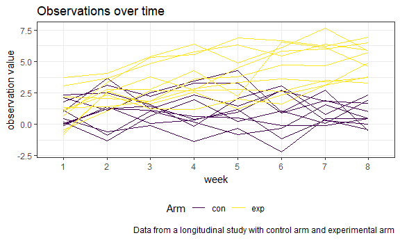
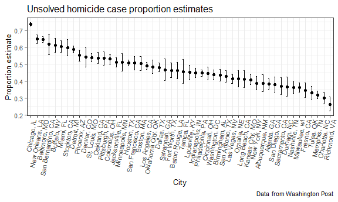

p8105\_hw5\_sal2222
================
Stephen Lewandowski
November 9, 2018

-   [Problem 1 - Longitudinal arm study](#problem-1---longitudinal-arm-study)
    -   [Data import and cleaning](#data-import-and-cleaning)
    -   [Plot of observations over time](#plot-of-observations-over-time)
    -   [Observed group differences](#observed-group-differences)
-   [Problem 2 - Homicides in U.S. cities](#problem-2---homicides-in-u.s.-cities)
    -   [Homicide data description](#homicide-data-description)
    -   [Baltimore Test of Equal or Given Proportions](#baltimore-test-of-equal-or-given-proportions)
    -   [All cities Test of Equal or Given Proportions](#all-cities-test-of-equal-or-given-proportions)
    -   [Plot of unsolved case proportion estimates](#plot-of-unsolved-case-proportion-estimates)

Problem 1 - Longitudinal arm study
----------------------------------

### Data import and cleaning

For this problem, I will create a tidy dataframe from all participants, including the subject ID, arm, and observations over time. The raw data includes 20 files, one for each subject, each with eight weeks of observations arranged in wide format.

I made a function to read-in the spreadsheet files and transform the data in each file from wide to long by week.

I then applied the function to each file name using `map_dfr` from the `purr` package and extracted the arm and subject ID variables from the file name.

``` r
# create vector of file names to load
files <- list.files(path = "./data", pattern = "*.csv", full.names = TRUE) %>% 
  set_names()

# create function to import and transform a file
import_file <- function(filename) 
{ 
  arm_file <- read.csv(file = filename) %>% 
     gather(key = week, value = value)
} 

# map file vector over the import function and tidy tibble
arm_df <- as_tibble(
  map_dfr(.x = files, import_file, .id = "file_name") %>% 
  separate(file_name, into = c("remove_1", "remove_2", "temp_1"), sep = "/") %>%
  mutate(arm_id = str_replace(temp_1, ".csv", ""),
         week = factor(str_replace(week, "week_", ""))) %>% 
  separate(arm_id, into = c("arm", "subject_id"), sep = "_", remove = FALSE) %>% 
  select(c("arm_id", "arm", "subject_id", "week",  "value")) %>% 
  mutate(subject_id = as.integer(subject_id),
         arm_id = factor(arm_id),
         arm = factor(arm))  
)       
arm_df
```

    ## # A tibble: 160 x 5
    ##    arm_id arm   subject_id week  value
    ##    <fct>  <fct>      <int> <fct> <dbl>
    ##  1 con_01 con            1 1      0.2 
    ##  2 con_01 con            1 2     -1.31
    ##  3 con_01 con            1 3      0.66
    ##  4 con_01 con            1 4      1.96
    ##  5 con_01 con            1 5      0.23
    ##  6 con_01 con            1 6      1.09
    ##  7 con_01 con            1 7      0.05
    ##  8 con_01 con            1 8      1.94
    ##  9 con_02 con            2 1      1.13
    ## 10 con_02 con            2 2     -0.88
    ## # ... with 150 more rows

### Plot of observations over time

I will make a spaghetti plot showing observations on each subject over time to observe differences between groups.

``` r
arm_df %>%
  ggplot(aes(x = week, y = value, group = arm_id, color = arm)) +
    geom_line() + 
    labs(
      title = "Observations over time",
      x = "week",
      y = "observation value",
      caption = "Data from a longitudinal study with control arm and experimental arm"
    ) + 
    viridis::scale_color_viridis(
      name = "Arm", 
      discrete = TRUE
    )
```



### Observed group differences

At the group level, experimental arm observation values were higher than control arm values. The experimental arm values increased over time, while the control arm values did not.

Problem 2 - Homicides in U.S. cities
------------------------------------

This problem includes data from the Washington Post on homicides in 50 large U.S. cities.

``` r
# import Washington Post homicide data
homicides <- read.csv("https://raw.githubusercontent.com/washingtonpost/data-homicides/master/homicide-data.csv")

# tidy Washington Post homicide data
homicides <- as.tibble(homicides) %>% 
  mutate(city_state = str_c(city, state, sep = ", ", collapse = NULL),
         unresolved = as.numeric(disposition != "Closed by arrest"),
         victim_age = as.numeric(victim_age),
         victim_race = fct_relevel(victim_race, "White")) %>% 
  select(-c("victim_last", "victim_first", "city", "state")) %>% 
  filter(city_state != "Tulsa, AL")


homicides
```

    ## # A tibble: 52,178 x 10
    ##    uid   reported_date victim_race victim_age victim_sex   lat   lon
    ##    <fct>         <int> <fct>            <dbl> <fct>      <dbl> <dbl>
    ##  1 Alb-~      20100504 Hispanic            79 Male        35.1 -107.
    ##  2 Alb-~      20100216 Hispanic            12 Male        35.1 -107.
    ##  3 Alb-~      20100601 White               10 Female      35.1 -107.
    ##  4 Alb-~      20100101 Hispanic            29 Male        35.1 -107.
    ##  5 Alb-~      20100102 White               73 Female      35.1 -107.
    ##  6 Alb-~      20100126 White               94 Female      35.2 -107.
    ##  7 Alb-~      20100127 Hispanic            51 Male        35.1 -107.
    ##  8 Alb-~      20100127 Hispanic            51 Female      35.1 -107.
    ##  9 Alb-~      20100130 White               55 Male        35.1 -107.
    ## 10 Alb-~      20100210 Hispanic            41 Male        35.1 -107.
    ## # ... with 52,168 more rows, and 3 more variables: disposition <fct>,
    ## #   city_state <chr>, unresolved <dbl>

### Homicide data description

In the raw data, the 50 included cities represent 28 unique states. The dataset contains information on a total of 52178 homicide cases. The cities with the most homicides are Chicago (5,535), Philadelphia (3,057), Houston (2,942), and Baltimore (2,827). The states with the most cases are California, Texas, Illinois, and Pennsylvania.

It contains victim information including name, race, age, and gender, along with the reported date of the homicide, grid coordinates for the location (missing for 60 cases), and case disposition status. The date range spans from January 2007 to November 2015.

The table below summarizes the total number of homicides and the number of unsolved homicides by city.

``` r
homicide_table <-
  homicides %>% 
    group_by(city_state) %>%
    summarize(total_homicides = as.numeric(n()),
              unsolved = sum(unresolved),
              prct_unsolved = mean(unresolved) * 100) %>% 
    mutate(city_state = factor(city_state))

homicide_table %>% 
  knitr::kable(digits = 1)
```

| city\_state        |  total\_homicides|  unsolved|  prct\_unsolved|
|:-------------------|-----------------:|---------:|---------------:|
| Albuquerque, NM    |               378|       146|            38.6|
| Atlanta, GA        |               973|       373|            38.3|
| Baltimore, MD      |              2827|      1825|            64.6|
| Baton Rouge, LA    |               424|       196|            46.2|
| Birmingham, AL     |               800|       347|            43.4|
| Boston, MA         |               614|       310|            50.5|
| Buffalo, NY        |               521|       319|            61.2|
| Charlotte, NC      |               687|       206|            30.0|
| Chicago, IL        |              5535|      4073|            73.6|
| Cincinnati, OH     |               694|       309|            44.5|
| Columbus, OH       |              1084|       575|            53.0|
| Dallas, TX         |              1567|       754|            48.1|
| Denver, CO         |               312|       169|            54.2|
| Detroit, MI        |              2519|      1482|            58.8|
| Durham, NC         |               276|       101|            36.6|
| Fort Worth, TX     |               549|       255|            46.4|
| Fresno, CA         |               487|       169|            34.7|
| Houston, TX        |              2942|      1493|            50.7|
| Indianapolis, IN   |              1322|       594|            44.9|
| Jacksonville, FL   |              1168|       597|            51.1|
| Kansas City, MO    |              1190|       486|            40.8|
| Las Vegas, NV      |              1381|       572|            41.4|
| Long Beach, CA     |               378|       156|            41.3|
| Los Angeles, CA    |              2257|      1106|            49.0|
| Louisville, KY     |               576|       261|            45.3|
| Memphis, TN        |              1514|       483|            31.9|
| Miami, FL          |               744|       450|            60.5|
| Milwaukee, wI      |              1115|       403|            36.1|
| Minneapolis, MN    |               366|       187|            51.1|
| Nashville, TN      |               767|       278|            36.2|
| New Orleans, LA    |              1434|       930|            64.9|
| New York, NY       |               627|       243|            38.8|
| Oakland, CA        |               947|       508|            53.6|
| Oklahoma City, OK  |               672|       326|            48.5|
| Omaha, NE          |               409|       169|            41.3|
| Philadelphia, PA   |              3037|      1360|            44.8|
| Phoenix, AZ        |               914|       504|            55.1|
| Pittsburgh, PA     |               631|       337|            53.4|
| Richmond, VA       |               429|       113|            26.3|
| Sacramento, CA     |               376|       139|            37.0|
| San Antonio, TX    |               833|       357|            42.9|
| San Bernardino, CA |               275|       170|            61.8|
| San Diego, CA      |               461|       175|            38.0|
| San Francisco, CA  |               663|       336|            50.7|
| Savannah, GA       |               246|       115|            46.7|
| St. Louis, MO      |              1677|       905|            54.0|
| Stockton, CA       |               444|       266|            59.9|
| Tampa, FL          |               208|        95|            45.7|
| Tulsa, OK          |               583|       193|            33.1|
| Washington, DC     |              1345|       589|            43.8|

### Baltimore Test of Equal or Given Proportions

For the city of Baltimore, MD, I will use the prop.test function to estimate the proportion of homicides that are unsolved and the confidence interval.

``` r
x <- homicide_table %>% 
  filter(city_state == "Baltimore, MD") %>% 
  pull(unsolved)

n <- homicide_table %>% 
  filter(city_state == "Baltimore, MD") %>% 
  pull(total_homicides)

baltimore_test <- prop.test(x, n)

baltimore_test %>% 
  broom::tidy() %>% 
  select(estimate, conf.low, conf.high) %>% 
  knitr::kable(digits = 3)
```

|  estimate|  conf.low|  conf.high|
|---------:|---------:|----------:|
|     0.646|     0.628|      0.663|

### All cities Test of Equal or Given Proportions

I will now extract the proportion of unsolved homicides and the confidence interval for each city using `purr::map2`.

``` r
all_city_prop_test <-
  homicide_table %>% 
    select(city_state, unsolved, total_homicides) %>% 
    mutate(prop_test = map2(unsolved, total_homicides, prop.test),
           prop_test = map(prop_test, broom::tidy)) %>% 
    unnest() %>% 
    select(city_state, estimate, conf.low, conf.high)
  
all_city_prop_test %>% 
  knitr::kable(digits = 3)
```

| city\_state        |  estimate|  conf.low|  conf.high|
|:-------------------|---------:|---------:|----------:|
| Albuquerque, NM    |     0.386|     0.337|      0.438|
| Atlanta, GA        |     0.383|     0.353|      0.415|
| Baltimore, MD      |     0.646|     0.628|      0.663|
| Baton Rouge, LA    |     0.462|     0.414|      0.511|
| Birmingham, AL     |     0.434|     0.399|      0.469|
| Boston, MA         |     0.505|     0.465|      0.545|
| Buffalo, NY        |     0.612|     0.569|      0.654|
| Charlotte, NC      |     0.300|     0.266|      0.336|
| Chicago, IL        |     0.736|     0.724|      0.747|
| Cincinnati, OH     |     0.445|     0.408|      0.483|
| Columbus, OH       |     0.530|     0.500|      0.560|
| Dallas, TX         |     0.481|     0.456|      0.506|
| Denver, CO         |     0.542|     0.485|      0.598|
| Detroit, MI        |     0.588|     0.569|      0.608|
| Durham, NC         |     0.366|     0.310|      0.426|
| Fort Worth, TX     |     0.464|     0.422|      0.507|
| Fresno, CA         |     0.347|     0.305|      0.391|
| Houston, TX        |     0.507|     0.489|      0.526|
| Indianapolis, IN   |     0.449|     0.422|      0.477|
| Jacksonville, FL   |     0.511|     0.482|      0.540|
| Kansas City, MO    |     0.408|     0.380|      0.437|
| Las Vegas, NV      |     0.414|     0.388|      0.441|
| Long Beach, CA     |     0.413|     0.363|      0.464|
| Los Angeles, CA    |     0.490|     0.469|      0.511|
| Louisville, KY     |     0.453|     0.412|      0.495|
| Memphis, TN        |     0.319|     0.296|      0.343|
| Miami, FL          |     0.605|     0.569|      0.640|
| Milwaukee, wI      |     0.361|     0.333|      0.391|
| Minneapolis, MN    |     0.511|     0.459|      0.563|
| Nashville, TN      |     0.362|     0.329|      0.398|
| New Orleans, LA    |     0.649|     0.623|      0.673|
| New York, NY       |     0.388|     0.349|      0.427|
| Oakland, CA        |     0.536|     0.504|      0.569|
| Oklahoma City, OK  |     0.485|     0.447|      0.524|
| Omaha, NE          |     0.413|     0.365|      0.463|
| Philadelphia, PA   |     0.448|     0.430|      0.466|
| Phoenix, AZ        |     0.551|     0.518|      0.584|
| Pittsburgh, PA     |     0.534|     0.494|      0.573|
| Richmond, VA       |     0.263|     0.223|      0.308|
| Sacramento, CA     |     0.370|     0.321|      0.421|
| San Antonio, TX    |     0.429|     0.395|      0.463|
| San Bernardino, CA |     0.618|     0.558|      0.675|
| San Diego, CA      |     0.380|     0.335|      0.426|
| San Francisco, CA  |     0.507|     0.468|      0.545|
| Savannah, GA       |     0.467|     0.404|      0.532|
| St. Louis, MO      |     0.540|     0.515|      0.564|
| Stockton, CA       |     0.599|     0.552|      0.645|
| Tampa, FL          |     0.457|     0.388|      0.527|
| Tulsa, OK          |     0.331|     0.293|      0.371|
| Washington, DC     |     0.438|     0.411|      0.465|

### Plot of unsolved case proportion estimates

I will create a plot that shows the estimates and confidence intervals for each city, organized according to the proportion of unsolved homicides.

``` r
all_city_prop_test %>%
    mutate(city_state = fct_reorder(city_state, estimate, .desc = TRUE)) %>% 
ggplot(aes(x = city_state, y = estimate)) +
    geom_point() +
    geom_errorbar(aes(ymin = conf.low, ymax = conf.high), width = 0.2) +
    theme(text = element_text(size = 10),
          axis.text.x = element_text(angle = 80, hjust = 1)) +
    labs(
      title = "Unsolved homicide case proportion estimates",
      x = "City",
      y = "Proportion estimate",
      caption = "Data from Washington Post"
    ) 
```


